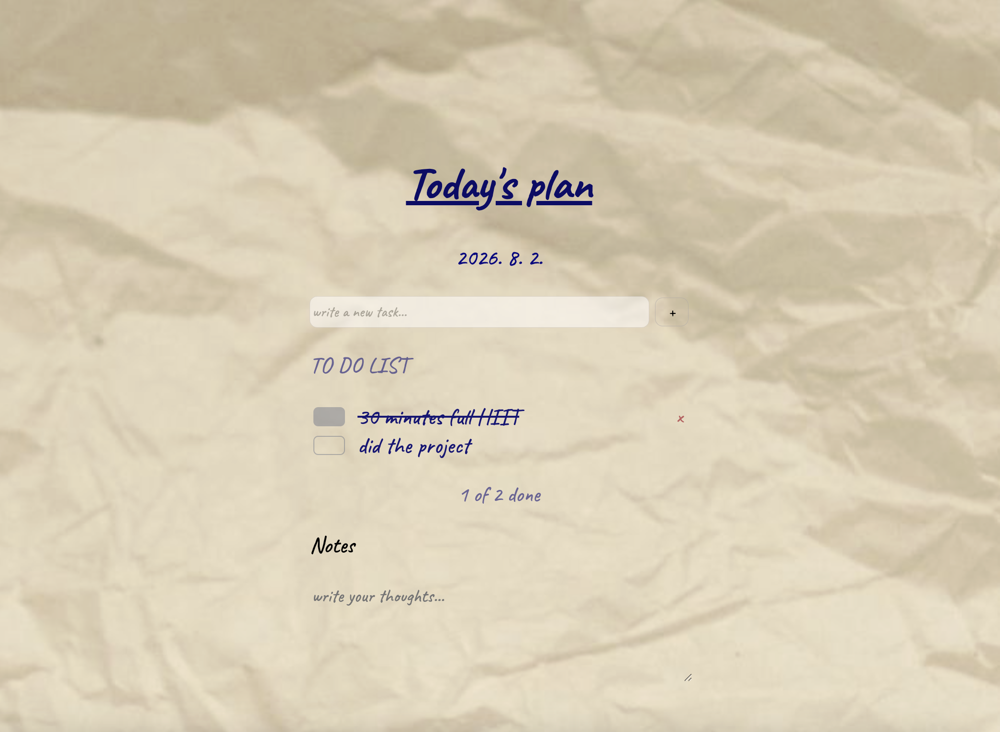

# Today's Plan

A paper-styled to-do list app with a handwritten aesthetic, built with vanilla JavaScript.

**[Live Demo](https://clxrie.github.io/to-do-list/)**

## Features

- **Add & delete tasks** — type a task and hit + to add, x to remove
- **Mark as done** — checkbox with strikethrough effect
- **Progress tracker** — shows how many tasks you've completed
- **Notes section** — jot down extra thoughts for the day
- **LocalStorage** — your tasks persist even after closing the browser
- **Today's date** — auto-displays the current date

## Built With

- HTML
- CSS
- JavaScript (no frameworks or libraries)

## What I Learned

This project was practice in DOM manipulation, localStorage for data persistence, dynamic element creation, and event handling. The paper texture background and handwriting font (Caveat) give it a personal, analog feel.